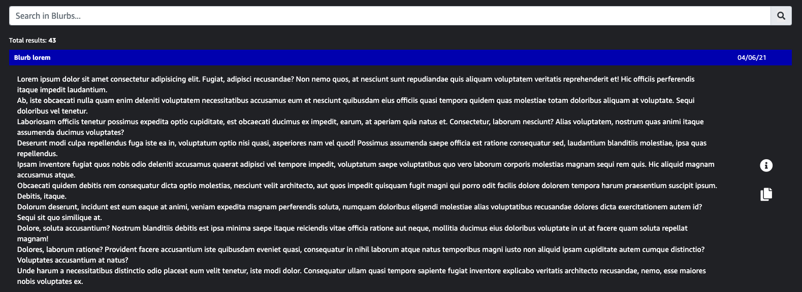

# Sorcerer's Guide

*Process Management Website*

**Note**: As of 16th July 2020, this project will be developed as an Amazon's internal website and further commit's will be made available to Amazon's GitHub repository.

## Table of contents
* [Introduction](#introduction)
* [Goal and Objectives](#goal-and-objectives)
* [Features](#features)

## Introduction
When doing a task, one might have several questions on how to proceed. What if we had a tool which could provide all the necessary answers to the user? What if we could get all the necessary information in which we might be interested in? Since the updates come every week, it is difficult to keep track of the ones which are ongoing and which are outdated. Imagine the amount of time we could save if we had a powerful tool which could give us the all the information at one glance. This tool provides the SOP updates, FAQs, queries and checklist at a single place for any process onboarded.

## Goal and Objectives
* To `increase the quality of output` (search a keyword and never miss any related info about it, added checklist will ensure no misses).
* To `increase the efficiency of associates` (opening multiple tabs, searching and retrieving the information takes time).
* `Reduction in queries` - 28% of queries raised were already forwarded as Process updates.
* `Easy accessibility to knowledge pool` and older updates for new hires and cross trained associates.
* `Reference point for every associate` coming back from health leaves/vacation to get hold of all the process updates and to acquire knowledge of the latest checks.
* `Individual productivity improvement` (Raising a query and waiting for SME response hampers productivity)
* `Individual quality improvement` (With answers conveniently available, count of non-genuine queries will reduce and errors can be saved).
* `No updates will be missed due to full mailbox`.

## Features
1. Authentication - 

 

2. Authorization - 

3. Search and filter - 

 

4. Dark mode - 

 

5. Checklist - 

6. 1 click annotation generation - 

7. Blurbs

And many more ...
